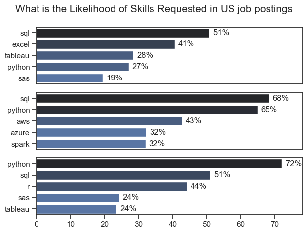

# Overview
This data analytics project explores the current job market for data analyst roles, offering actionable insights for job seekers and career planners. Leveraging a comprehensive dataset from [Luke Barousse's Python Course](https://lukebarousse.com/python), this analysis investigates salary trends, in-demand skills, and the intersection between compensation and market demand.

The dataset includes detailed information on job titles, salaries, locations, and required skills, providing a robust foundation for answering key questions such as:

- Which skills are most frequently requested by employers?
- How do salaries vary across different skills and locations?
- What skills offer the best balance between high demand and high compensation?

Through a series of Python-powered analytical scripts, this project transforms raw job posting data into meaningful insights—helping data professionals identify the most promising opportunities and strategically position themselves in a competitive market.

## Research Questions
This project seeks to answer the following key questions about the data analytics job market:

1. What are the most in-demand skills for the top three most popular data roles?
Identifying the technical competencies employers prioritize most frequently across different data positions.
2. How are skill requirements trending for Data Analysts over time?
Tracking the evolution of demanded skills to reveal emerging technologies and declining ones.
3. What is the relationship between skills, job roles, and salary levels for Data Analysts?
Analyzing how different skills and positions correlate with compensation.
4. Which skills offer the optimal balance between high demand and high salary?
Pinpointing the most strategic skills for Data Analysts to learn—those that are both frequently requested and highly compensated.

## Tools I Used
For this deep dive into the data analyst job market, I leveraged a powerful stack of modern data analytics tools:

| **Tool/Library** | **Purpose** |
|:-----------------|:------------|
| **Python** | The core programming language powering my entire analysis—from data manipulation to insight generation. |
| **Pandas** | Used for data cleaning, transformation, and exploratory analysis. |
| **Matplotlib** | Created foundational visualizations to illustrate key trends and patterns. |
| **Seaborn** | Enabled more sophisticated and aesthetically pleasing statistical visualizations. |
| **Jupyter Notebooks** | Provided an interactive environment to run Python scripts while seamlessly integrating code, visualizations, and documentation. |
| **Visual Studio Code** | Served as my primary integrated development environment (IDE) for writing and executing Python scripts. |
| **Git & GitHub** | Essential for version control, code sharing, and project collaboration—ensuring transparency and reproducibility throughout the analysis lifecycle. |

## Data Preparation and Cleanup
This section outlines the steps taken to prepare the data for analysis, ensuring accuracy and usability.
### Import & Cleanup Data
I start by importing necessary libraries and loading the dataset, followed by initial data cleaning tasks to ensure data quality.
```python
# Import Libraries
import ast
import pandas as pd
import seaborn as sns
from datasets import load_dataset
import matplotlib.pyplot as plt

# Load Data
dataset = load_dataset("lukebarousse/data_jobs")
df = dataset["train"].to_pandas()

# Data Cleanup
df["job_posted_date"] = pd.to_datetime(df["job_posted_date"])
df["job_skills"] = df["job_skills"].apply(lambda x: ast.literal_eval(x) if pd.notna(x) else x)
```
### Filter US Jobs
```python
# Filter for only United States in the job_country
df_US = df[df["job_country"] == "United States"]
```

## The Analysis
Each Jupyter notebook for this project aimed at investigating specific aspects of the data job market. Here’s how I approached each question:

### 1. What are the most in-demand skills for the top three most popular data roles?
To identify the most sought-after skills for leading data roles, I isolated the top three most frequently posted positions and extracted their five most common required skills. This targeted analysis reveals the key competencies needed for each career path, enabling strategic skill development based on specific role aspirations.

View my notebook with detailed steps here:[ 2_Skill_Demand.](3_Project/2_Skill_Demand.ipynb)

Data Visualization
```python
# Plotting the data
fig, ax = plt.subplots(len(job_titles), 1)

sns.set_theme(style="ticks")

# Iterate through the job_titles
for i, job_title in enumerate(job_titles):
    df_plot = df_skills_perc[df_skills_perc["job_title_short"] == job_title].head(5)  # Filter the job_title_short of the df_skills_count to only show job titles for the top 3 roles by the top 5 skills
    sns.barplot(data=df_plot, x="skill_percent", y="job_skills", ax=ax[i], hue="skill_percent", palette="dark:b_r")    
    ax[i].set_xlabel("")
    ax[i].set_xlim(0, 78)
    ax[i].set_ylabel("")
    ax[i].legend().set_visible(False)

    # Loop through and set titles for the data using text
    for n, v in enumerate(df_plot["skill_percent"]):
        ax[i].text(v + 1, n, f"{v:.0f}%", va="center")

    # remove the x label for the top 2 charts
    if i != len(job_titles) -1:
        ax[i].set_xticks([])

fig.suptitle("What is the Likelihood of Skills Requested in US job postings", fontsize=15)
plt.tight_layout()  # Fix the overlap
plt.show()
```

Results



*Bar graph visualizing the salary for the top 3 data roles and their top 5 skills associated with each.*

**Insights:**

- Data Analysts face a diverse but focused skill landscape, with SQL dominating at 51%—reinforcing its position as the non-negotiable foundation for the role. Excel follows closely at 41%, highlighting its continued relevance for business-facing analytics, while visualization tools like Tableau (28%) and programming languages like Python (27%) show nearly equal importance, suggesting employers value a hybrid of traditional and modern analytical tools.

- Data Engineers command a cloud-centric skillset, with SQL (68%) and Python (65%) as near-ubiquitous requirements, reflecting the need for strong database and scripting capabilities. The prominent presence of AWS (43%), Azure (32%), and Spark (32%) underscores the industry's shift toward cloud-native data engineering and distributed computing, making cloud platform expertise essential for this role.

- Data Scientists prioritize Python above all (72%) , establishing it as the undisputed lingua franca of advanced analytics. SQL (51%) remains critical for data extraction, while R (44%) maintains a strong foothold, suggesting a continued appreciation for statistical computing. The lower but meaningful demand for SAS and Tableau (both 24%) indicates that while specialized tools matter, foundational programming and database skills remain paramount.

### 2. How are skill requirements trending for Data Analysts over time?
To analyze skill trends for Data Analysts throughout 2023, I filtered for data analyst roles and aggregated required skills by posting month. This longitudinal analysis tracks the monthly prevalence of the top five skills, revealing their popularity trajectories over the year.

View my notebook with detailed steps here: [3_Skills_Trend](3_Project/3_Skills_Trend.ipynb)

Data Visualization
```python
df_plot = df_DA_US_percent.iloc[:, :5]

sns.lineplot(data=df_plot, dashes=False, palette="tab10")
sns.set_theme(style="ticks")
sns.despine()

plt.title("Trending Top Skills for Data Analysts in the US")
plt.ylabel("Likelihood in Job Posting")
plt.xlabel("2023")
plt.legend().remove()

from matplotlib.ticker import PercentFormatter
ax = plt.gca()
ax.yaxis.set_major_formatter(PercentFormatter(decimals=0))

for i in range(5):
    plt.text(11.2, df_plot.iloc[-1, i], df_plot.columns[i])

plt.show()
```

Results


*Bar graph visualizing the trending top skills for data analysts in the US in 2023.*

**Insights:**

- SQL maintains dominance but shows a gradual decline throughout 2023, dropping from 64% in January to 48% by December—a 16 percentage point decrease. Despite this downward trend, SQL remains the most requested skill every month, reinforcing its foundational importance for Data Analysts even as the skill landscape diversifies.

- Tableau experiences remarkable growth mid-year, surging from 25% in January to a peak of 45% in July—an 80% increase in demand. This dramatic rise suggests a mid-2023 shift toward prioritizing data visualization expertise, though it moderates slightly in subsequent months while remaining elevated above年初 levels.

- Python and Excel show remarkable stability throughout the year, with Python consistently hovering between 33-39% and Excel maintaining a steady 41-49% range. This consistency indicates these tools have become baseline expectations for Data Analysts, while Power BI shows modest but steady growth—climbing from 18% to 25% by year-end—suggesting increasing adoption of Microsoft's visualization platform.

### 3. How well do jobs and skills pay for Data Analysts?
